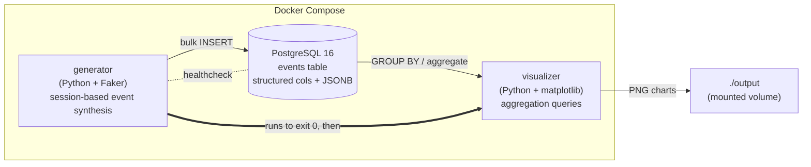
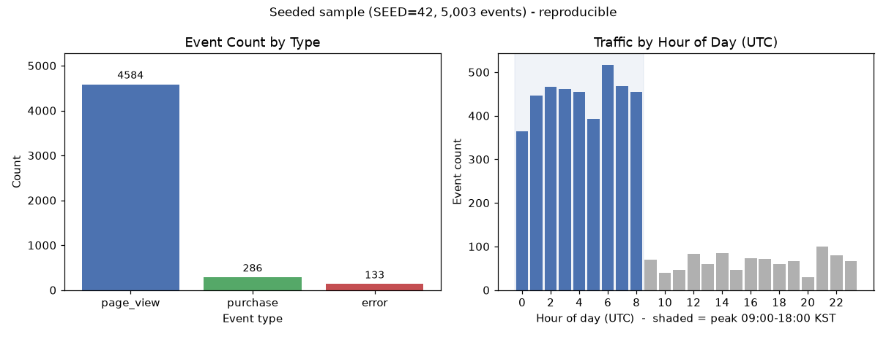
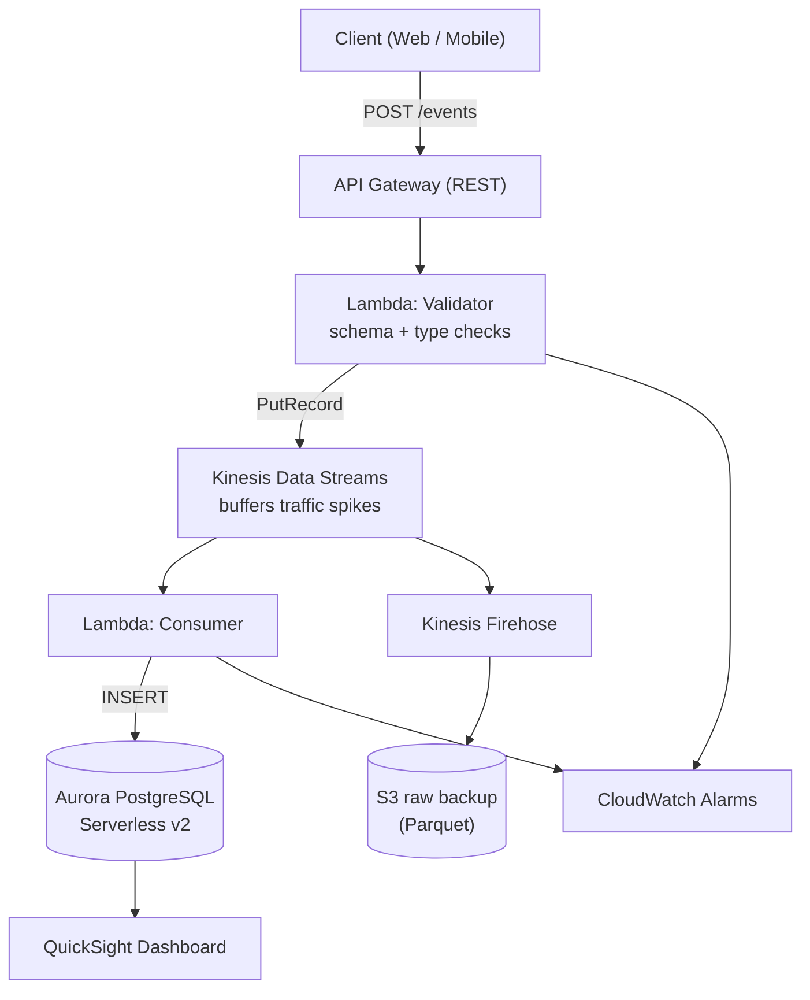

# Event Pipeline

[](https://github.com/hurjun/futurescole/actions/workflows/ci.yml)

A containerized data pipeline that **simulates realistic web-service event traffic**,
stores it in **PostgreSQL**, and renders **analytics charts** — orchestrated end-to-end
with Docker Compose. The repository also ships Kubernetes manifests and an AWS reference
architecture as design exercises.

The goal of the project is to model a high-volume, schema-varied telemetry stream the way
a real e-commerce backend produces one (session funnels, conversion/error rates, peak-hour
bias, repeat visitors) and to back the design choices with a deliberate schema, reproducible
generation, and an automated test suite.

---

## Architecture



The three services run as a **batch pipeline**, not long-running daemons:

1. `db` starts PostgreSQL and is gated by a healthcheck.
2. `generator` waits for the DB to be healthy, synthesizes `EVENT_COUNT` events, bulk-inserts
   them, and exits `0`.
3. `visualizer` waits for the generator to *complete successfully*
   (`depends_on: condition: service_completed_successfully`), runs the analytics queries,
   writes two PNG charts to the mounted `./output` volume, and exits.

---

## Quick Start

**Prerequisites:** Docker Desktop (or any Docker Engine with Compose v2) running.

```bash
git clone https://github.com/hurjun/futurescole.git
cd futurescole
docker compose up --build
```

When the pipeline finishes, two charts appear in `./output/`:

| File | Description |
|------|-------------|
| `event_type_distribution.png` | Bar chart — event count by type |
| `hourly_trend.png` | Line chart — event volume per hour |

Useful overrides:

```bash
# Generate a larger dataset
EVENT_COUNT=5000 docker compose up --build

# Deterministic, fully reproducible dataset (see "Reproducibility")
SEED=42 EVENT_COUNT=5000 docker compose up --build

# Override the (non-production) demo credentials
POSTGRES_USER=me POSTGRES_PASSWORD=secret POSTGRES_DB=events docker compose up --build
```

---

## Results

The numbers below were measured from a deterministic run (`SEED=42`, `EVENT_COUNT=5000`).
Because the random stream is seeded, the **event counts and rates are fully reproducible**;
only the absolute timestamps shift with the wall clock. They confirm the generator hits its
design targets (~20% session conversion, ~10% session error, ~80% peak-hour traffic).



> The figure above is generated from the **real seeded dataset** (not hand-drawn). The left
> panel is the event-type distribution; the right panel buckets traffic by hour of day and the
> shaded band marks the designed peak window (09:00–18:00 KST = 00:00–09:00 UTC), making the
> ~80% peak-hour bias visible. Regenerate it with:
>
> ```bash
> pip install matplotlib faker            # matplotlib only needed for this offline figure
> SEED=42 EVENT_COUNT=5000 python analysis/make_figures.py   # writes docs/sample_results.png
> ```
>
> Unlike the Dockerized `visualizer` service, this script needs no live PostgreSQL: it runs the
> generator and the same aggregations against an in-memory SQLite DB (see
> [`analysis/make_figures.py`](analysis/make_figures.py)).

| Metric | Value |
|--------|-------|
| Total events | 5,003 |
| Sessions | 1,513 |
| Distinct users | 50 (fixed pool) |
| `page_view` events | 4,584 (91.6%) |
| `purchase` events | 286 (5.7%) |
| `error` events | 133 (2.7%) |
| Session conversion rate | 18.9% (target ~20%) |
| Session error rate | 8.8% (target ~10%) |
| Peak-hour share (00–09 UTC = 09–18 KST) | 80.5% (theoretical ~81%) |

> Per-*event* purchase/error shares are low (~6% / ~3%) because each converting session
> contains many `page_view` events; the **per-session** conversion/error rates are the
> design targets and land at ~19% / ~9%.

---

## Event Model & Simulation Design

Three event types cover the core signals of an e-commerce service:

| Type | Meaning | Key `properties` |
|------|---------|------------------|
| `page_view` | A user views a page (the bulk of traffic / UX signal) | `page_path`, `referrer`, `duration_ms` |
| `purchase` | A completed checkout (the conversion / business metric) | `item_id`, `amount_krw`, `payment_method` |
| `error` | A server/client error (the reliability metric) | `error_code`, `message`, `stack_trace_hash` |

**Session-based generation, not uniform noise.** Events are produced per *session*, not
independently, so the data follows a realistic funnel:

- every session begins with **1–5 `page_view`s** (browsing),
- with **20% probability** the user converts (`purchase`),
- with **10% probability** an `error` occurs somewhere in the session,
- timestamps advance a few seconds at a time within a session.

This yields meaningful conversion funnels, per-session page-view distributions, and Top-N
user analytics — none of which emerge from purely uniform-random events.

**Peak-hour bias.** 70% of traffic is forced into business hours (09:00–18:00 KST, i.e.
00:00–09:00 UTC); the rest is uniform over the day. The resulting peak share (~81%)
reproduces a realistic daily traffic curve.

**Fixed 50-user pool.** User ids are drawn from a fixed pool of 50 UUIDs so that
repeat-visit and Top-user analytics are non-trivial. Fully random UUIDs would make every
user a one-time visitor.

---

## Database Schema & Rationale

```sql
CREATE TABLE events (
    id          SERIAL      PRIMARY KEY,
    event_type  VARCHAR(50) NOT NULL,
    user_id     VARCHAR(36) NOT NULL,
    session_id  VARCHAR(36) NOT NULL,
    timestamp   TIMESTAMPTZ NOT NULL,
    properties  JSONB       NOT NULL,
    created_at  TIMESTAMPTZ NOT NULL DEFAULT NOW()
);
-- indexes on event_type, user_id, timestamp (the aggregation keys)
```

**Why PostgreSQL.** The workload is structured analytical aggregation (counts by type,
per-user stats, hourly trends), which is exactly what a relational engine with SQL
aggregation and indexing does best. PostgreSQL additionally offers `JSONB`, giving schema
flexibility *and* indexable structured columns in one store.

**Structured columns + `JSONB`, not a single blob.** The fields common to every event
(`event_type`, `user_id`, `session_id`, `timestamp`) are first-class indexed columns, while
the per-type metadata lives in a `properties JSONB` column. This keeps aggregation queries
fast (indexed columns) while allowing new event types without a schema migration — and it
deliberately avoids the "store the whole event as one JSON blob" anti-pattern, which would
make every aggregation a full scan with JSON extraction.

**`created_at` vs `timestamp`.** `timestamp` is when the event *occurred*; `created_at` is
when it was *ingested*. Separating them keeps event-time analytics correct even if ingestion
is delayed.

The four analytics queries live in [`analysis/queries.sql`](analysis/queries.sql): event
count by type, Top-10 users, hourly distribution, and error ratio.

---

## Reproducibility

Set the `SEED` environment variable to make a run fully deterministic. Seeding covers
`random`, Faker, **and** the UUID-derived ids (which are drawn from the seeded RNG rather
than `os.urandom`), so the entire dataset — types, ids, and `properties` — is reproducible:

```bash
SEED=42 EVENT_COUNT=5000 docker compose up --build
```

This is what makes the **Results** table above reproducible and what keeps the test suite
deterministic.

---

## Testing & CI

The test suite is **hermetic** — it never needs the live PostgreSQL container. Generation
logic is pure Python, and the analytics queries are validated against an in-memory SQLite
database whose schema mirrors `db/init.sql`.

```bash
python -m venv .venv && source .venv/bin/activate
pip install -r requirements-dev.txt
ruff check .
pytest
```

What is covered (`tests/`):

- **`test_generator.py`** — property builders, session structure (1–5 page views, ordering,
  at most one purchase/error), the aggregate funnel distribution (conversion ~20%, error
  ~10%), peak-hour bias, and seed-based determinism.
- **`test_load.py`** — the bulk-insert path: SQL/parameter binding via a fake cursor, plus a
  SQLite round-trip that confirms every row and its `JSONB` payload survive load.
- **`test_analytics.py`** — SQLite ports of the four `analysis/queries.sql` aggregations,
  each cross-checked against an independent pure-Python computation (including the null-safe
  empty-table case).

[GitHub Actions CI](.github/workflows/ci.yml) runs `ruff` lint and the full `pytest` suite on
Python 3.12 and 3.13 for every push and pull request.

---

## Engineering Decisions / Reflections

- **Uniform-random vs session-based generation.** Independent random events produce
  nonsensical data (e.g. five `purchase`s and no `page_view` in one session). Modeling
  sessions as funnels is what makes conversion/retention analytics meaningful.
- **Guaranteed clean termination.** `service_completed_successfully` only works if the
  generator exits `0`. DB connection retries are capped (5 attempts, exponential backoff) and
  raise on exhaustion, so the container fails fast instead of hanging forever.
- **Credentials via env vars.** No passwords are hardcoded. `docker-compose.yml` uses
  `${VAR:-default}` so the demo runs out of the box, while every value is overridable. The
  defaults (`eventuser`/`eventpass`) are **non-production demo credentials**.
- **`JSONB` for heterogeneous metadata.** Splitting per-type fields into separate tables
  would force JOINs on every query; a single JSON blob would lose indexability. `JSONB`
  balances flexibility and query performance.
- **Testability by decoupling.** The generator imports `psycopg2` lazily, so its
  probabilistic logic can be imported and unit-tested without a database driver installed.

---

## Kubernetes (Optional)

Manifests for the `generator` app, written as a structural design exercise (not deployed):

```bash
# Create the Secret first (real deployments)
kubectl create secret generic generator-secret \
  --from-literal=POSTGRES_PASSWORD=your_password

kubectl apply -f k8s/configmap.yaml
kubectl apply -f k8s/deployment.yaml
```

**Why a Deployment, not a bare Pod?** A standalone Pod is gone permanently if its node fails
or it is OOM-killed. A Deployment manages a ReplicaSet that keeps `replicas: 2` running,
restarts failed Pods automatically, and supports rolling updates.

**Why a ConfigMap, not hardcoded env?** Hardcoding DB connection info into the image forces a
rebuild per environment (dev/staging/prod). A ConfigMap externalizes non-sensitive config so
only the values change. Secrets (e.g. the password) belong in a `Secret`, never a ConfigMap
(which stores plaintext).

---

## AWS Reference Architecture (Optional)

Diagram source: [`aws/architecture.drawio`](aws/architecture.drawio) (open at
[diagrams.net](https://app.diagrams.net)).



**Ingestion (API Gateway + Lambda + Kinesis).** API Gateway provides HTTPS, auth, and
throttling with no code. A validator Lambda pushes events into Kinesis instead of writing to
the DB directly, so traffic spikes are *buffered* rather than exhausting DB connections;
Kinesis also preserves ordering and enables replay (versus SQS).

**Storage (Aurora Serverless v2 + S3).** Aurora PostgreSQL migrates the local schema as-is
and serves complex aggregations and real-time dashboards; Serverless v2 scales to near-zero
when idle. Firehose lands raw events in S3 as Parquet for cheap, large-scale Athena analysis.

**Visualization (QuickSight + CloudWatch).** QuickSight connects directly to Aurora for
SQL-backed dashboards with IAM access control; CloudWatch tracks Lambda error rate/latency and
fans out alarms via SNS.

---

## Project Structure

```
.
├── db/
│   └── init.sql              # table + indexes
├── generator/
│   ├── main.py               # session-based event synthesis + bulk insert
│   ├── requirements.txt
│   └── Dockerfile
├── visualizer/
│   ├── main.py               # aggregation queries + PNG charts
│   ├── requirements.txt
│   └── Dockerfile
├── analysis/
│   └── queries.sql           # the 4 analytics queries
├── tests/                    # hermetic pytest suite (no live Postgres)
│   ├── conftest.py
│   ├── test_generator.py
│   ├── test_load.py
│   └── test_analytics.py
├── k8s/
│   ├── deployment.yaml       # generator Deployment (replicas=2, resource limits)
│   └── configmap.yaml        # DB connection config
├── aws/
│   └── architecture.drawio   # AWS reference architecture
├── output/                   # generated charts (volume mount; gitignored)
├── .github/workflows/ci.yml  # lint + tests
├── requirements-dev.txt      # lint/test deps
├── pyproject.toml            # ruff + pytest config
└── docker-compose.yml
```
